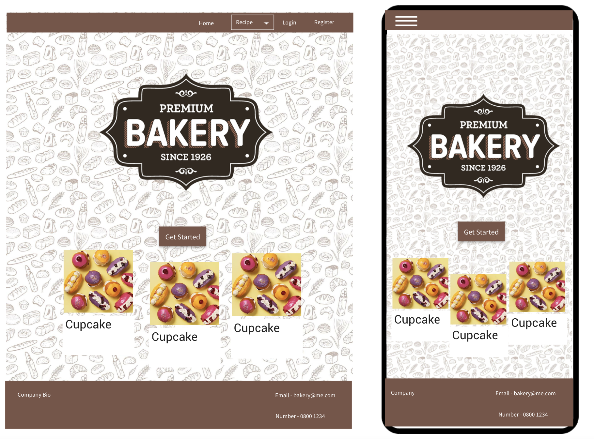
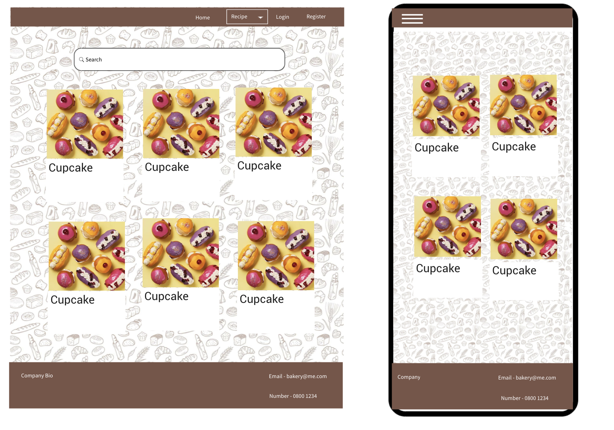
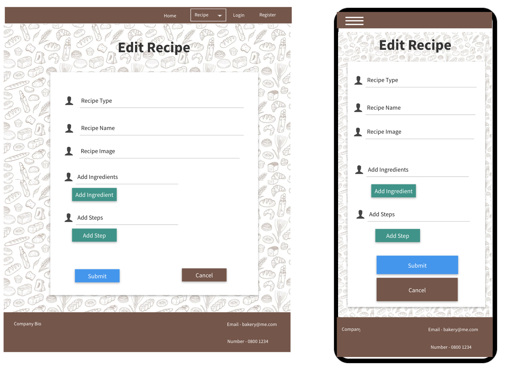
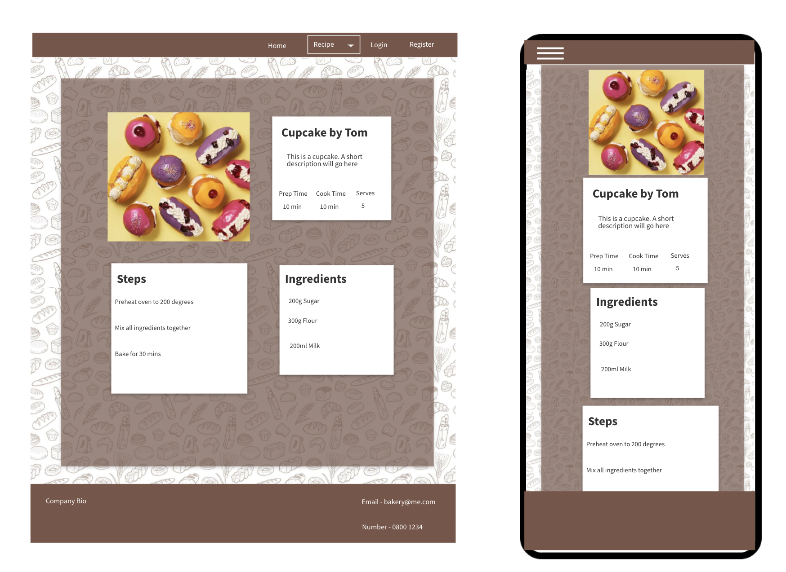
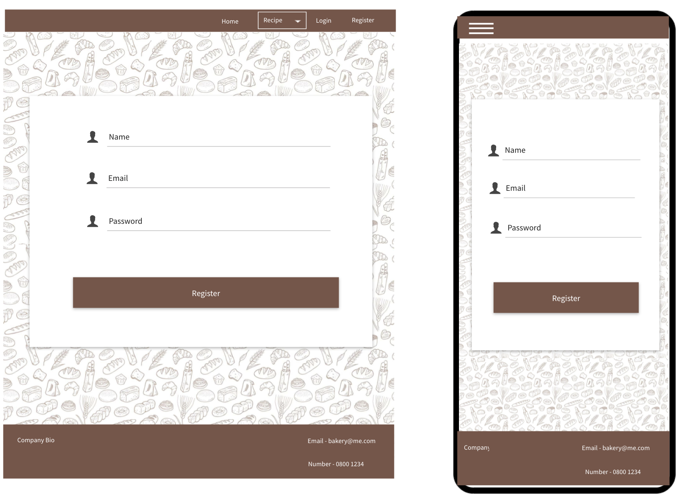
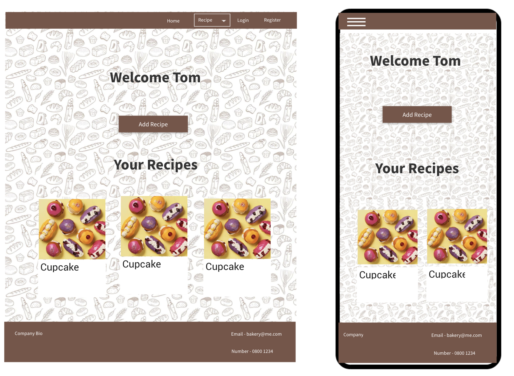

<h1>Toms Bakery</h1>

[View the live project here.](https://backend-project-ms3.herokuapp.com)

Toms Bakery was designed to bring a community together with a shared passion for baking and who were interested in learning and sharing knowledge. Users can create/log into their account and upload their own recipes, as well as view ones uploaded by others.

<span id="ux"></span>

<h1>User experience (UX)</h1>

<span id="ux-goals"></span>

### 1.1 Project goals 

The goal for this project was to make a clear, concise and easy to understand website that allows people interested in bakery to share and view recipes. All steps required to make a profile, upload and share recipes should be easy to navigate and clear. Navigating the website should be slick and without obvious errors. The design of the website should fit the topic alongside being visually appealing.

<span id="ux-stories"></span>

### User stories 

**First-time visitor goals:**
1. As a first time visitor, I want to easily understand the purpose of the website.
2. As a first time visitor, I want to be able to easily navigate throughout the site to find content.
3. As a first time visitor, I want to view recipes created by other users, sorted by categories.
4. As a first time visitor, I want to be able to visit the website on every device with formatting appropriate for all screen sizes.
5. As a first time visitor, I want to be able to search recipes and have relevant results show.
6. As a first time visitor, I want to register an account on the website, so I can upload my own recipes. 


**Site member goals:** 
1. As a returning user, I want to add recipes that I have created. 
2. As a returning user, I want to edit my recipes, this may be because of an input error or recent alteration to the old recipe.
3. As a returning user, I want to be able to delete my recipes that I no longer want on the website. 
4. As a returning user, I want to login to my profile, which will show a selection of my recipes on my profile page. 
5. As a returning user, I want to be able to logout of my profile. 


<span id="ux-design"></span>

### Design 

- #### Colour scheme 
I used a colour scheme that I felt would reflect the look of a rustic cookbook.

- **The brown colour** is used in the navbar, footer, buttons and as a background colour for recipe card elements. 
- **The white colour** is used to contrast the brown, it is mainly used on text to make it standout. 
- **The green colour** is used on some buttons to differentiate it from other buttons with different functions. 
- **The red colour** is used on some buttons to differentiate it from other buttons with different functions. 
- **The blue colour** is used on some buttons to differentiate it from other buttons with different functions. 

- #### Fonts
The Materialize standard Roboto font on the whole website. I felt that it matched the style of my website design while being clear and easy to read.

- #### Icons
The icons used are the Google Material Design icons, I chose these for their integration with Materialize and the wide selection on offer. I was able to easily find everything I needed with this library. 

- #### Images
The images I used for this project came from [BBC Goodfood](https://www.bbcgoodfood.com/). These images are used on all the recipe cards as they provide a consistent style. 

- #### Defensive design 
    - The register form: 
        - Validates the email input to ensure it is valid. 
    - The add and edit recipe form:
        - The category selection is from a dropdown list of set choices, this prevents misspelling that would negatively affect searching and display of the categories on the page.
        - Requires that all fields have some text entered.
        - The number of serves, prep and cook time has to be a number.

### Wireframes 

#### Home Page


#### View Recipes


#### Edit Recipe


#### Full Recipe


#### Register


#### Profile


<span id="features"></span>

<h1>Features</h1>

<span id="features-existing"></span>

### 2.1 Existing features 

#### 1. Design 
- An attractive and simple layout with consistency.
- Simple navigation throughout the website by using the navigation bar. 
- Clear display of steps required to bake the recipe shown.
- Layout that fits with the design of a cookbook.

#### 2. General 
- Responsive header that changes options if the user is logged in/out. 
- Contact info in footer. 
- Responsive on all devices and screen sizes. 
- Reactive elements that respond to user input (buttons). 

#### 3. Recipes
- Recipes can be created, read, updated and deleted (CRUD) by the users that created them. 
- Recipes are displayed by category, this is displayed in the navbar.
- People can search for recipes. 
- Users can log onto their profile and view all recipes they have created. 
- Steps and ingredients can contain as many inputs as the user requires.

<span id="features-future"></span>

### 2.2 Features left to implement in the future 
- Ability for users to like/favourite recipes and have that displayed on a separate page.  
- Direct file upload option for recipe image. 
- More defensive programming such as a confirmation message for recipe deletion.
- The user can delete their profile to remove their information from the database (Data Protection Laws).

<span id="technologies"></span>

<h1>3. Technologies used</h1>

#### Languages used
- [HTML5](https://en.wikipedia.org/wiki/HTML5)
    - HTML5 provides the structure and the content for my project. 
- [CSS3](https://en.wikipedia.org/wiki/Cascading_Style_Sheets)
    - CSS3 provides the style of the HTML5 elements.
- [jQuery](https://jquery.com/)
    - jQuery used as the JavaScript functionality.
- [Python](https://www.python.org/)
    - Python provides the backend of the project.

#### Frameworks, libraries & Other
- [Gitpod](https://www.gitpod.io/) 
    - The GitPod is used to develop the project.
- [Git](https://git-scm.com/)
    - The Git was used for version control to commit to Git and push to GitHub.
- [GitHub](https://github.com/)
    - The GitHub is used to host the project.
- [Google Fonts](https://fonts.google.com/)
    - Google Fonts is used to provide the font roboto for all the text that is used in the project. 
- [Figma](https://www.figma.com/)
    - Figma is used to create the mockup designs for the project.
- [Materialize](https://materializecss.com/)
    - Materialize is used for the design framework.
- [MobgoDB](https://www.mongodb.com/1)
    - MongoDB is the fully managed cloud database service used for the project.
- [Heroku](https://dashboard.heroku.com/)
    - Heroki is the cloud platform for deploying the app.
- [Flask](https://flask.palletsprojects.com/en/1.1.x/)
    - Flask is the web framework used to provide libraries, tools and technologies for the app.
- [Jinja](https://jinja.palletsprojects.com/en/2.11.x/)
    - Jinja is used for templating Python
- [Werkzeug](https://werkzeug.palletsprojects.com/en/1.0.x/)
    - Werkzeug is used for password hashing and authentication and authorization.

#### Testing tools used 
- [Chrome DevTools](https://developers.google.com/web/tools/chrome-devtools/open) is used to detect problems and test responsiveness.
- [W3C Markup Validation Service](https://validator.w3.org/)
    - The W3C Markup Validation Service is used to check whether there were any errors in the HTML5 code. 
- [W3C CSS validator](https://jigsaw.w3.org/css-validator/)
    - The W3C CSS validator is used to check whether there were any errors in the CSS3 code.
- [JShint](https://jshint.com/)
    - JShint is a JavaScript validator that is used to check whether there were any errors in the JavaScript code. 
- [PEP8](http://pep8online.com/)
    - The PEP8 validator is used to check whether there were any errors in the Python code.

<span id="testing"></span>

<h1>Testing</h1>

The testing process can be found [here!](TESTING.md).

<span id="deployment"></span>

<h1>5. Deployment</h1>

## Heroku Deployment
This project was deployed through Heroku using the following steps:

### Requirements and Procfile
Heroku needs to know which technologies are being used and any requirements. Before creating the Heroku app, create these files using the following steps: 
1. Create `requirements.txt` file that contains the names of packages being used in Python. It is important to update the file if other packages or modules are installed during the project.
2. Create `Procfile` that contains the name of the application file so that Heroku knows what to run.
3. Create and `env.py` file using the following information:
```
import os
os.environ.setdefault("IP", "0.0.0.0")
os.environ.setdefault("PORT", "5000")
os.environ.setdefault("SECRET_KEY", " *unique secret key* ")
os.environ.setdefault("MONGO_URI", " *unique uri from mongo.db * ")
os.environ.setdefault("MONGO_DB", " *database name* ")
```

This information should not be made public, create a .gitignore file and include the `env.py` to prevent private information being stolen. 

### Creating Heroku App
- Log into Heroku.
- Click "create new app".
- Follow the steps to setup the app.
- Be sure to select the server that is closest to your current location.

### Connecting Heroku to GitHub
- In the "Deploy" section click "Github".
- Follow the steps and find the repository you would like to connect to. 
- Once Github is connected click the "Settings" button and click "Reveal Config Vars".
- Add new fields that match the entries below.

IP                                 
PORT                              
SECRET_KEY                       
MONGO_URI                          
MONGO_DBNAME   

- The values should match your `env.py` file.
- Enable Automatic deployment.
- The app should now be built after every Github commit, click "Open App" to view the live site.

### Forking the GitHub Repository

By forking the GitHub Repository we make a copy of the original repository on our GitHub account to view and/or make changes without affecting the original repository by using the following steps.

1. Log in to GitHub and locate the [GitHub Repository](https://github.com/)
2. At the top of the Repository (not top of page) just above the "Settings" Button on the menu, locate the "Fork" Button.
3. You should now have a copy of the original repository in your GitHub account.

### Making a Local Clone

1. Log in to GitHub and locate the [GitHub Repository](https://github.com/)
2. Under the repository name, click "Clone or download".
3. To clone the repository using HTTPS, under "Clone with HTTPS", copy the link.
4. Open Git Bash.
5. Change the current working directory to the location where you want the cloned directory to be made.
6. Type `git clone`, and then paste the URL you copied in Step 3.
7. Press Enter. Your local clone will be created.

- Import your `env.py` file to the project.
- Run `pip install -r requirements.txt` to install the packages necessary to run this app. 

<span id="credits"></span>

<h1>6. Credits</h1>

-   All Recipes and Recipe images are from [BBC Goodfood](https://www.bbcgoodfood.com/)

-   [Materialize](https://materializecss.com/) : Materialize has been used throughout this project. I have taken examples from the website to form the grid layout, carousel, forms, buttons, navbar and footer.

-   [Error Functions](https://flask.palletsprojects.com/en/2.0.x/errorhandling/) : I used this link to create the error functions in my app.py folder.

-   Browser icon from (https://www.pngwing.com/en/free-png-mtdhu/download)

-   Homepage logo from (https://graphicdesignjunction.com/2014/11/free-vector-bakery-logos-label/)

-   Background image from (https://getwallpapers.com/collection/desktop-wallpaper-pattern)

<span id="acknowledgements"></span>

<h1>7. Acknowledgements</h1>

-   My Mentor for continuous helpful feedback.

-   Tutor support at Code Institute for their support.


