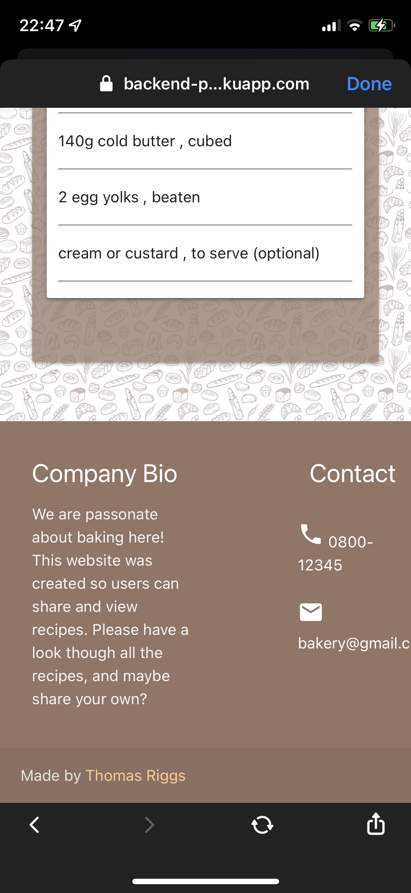
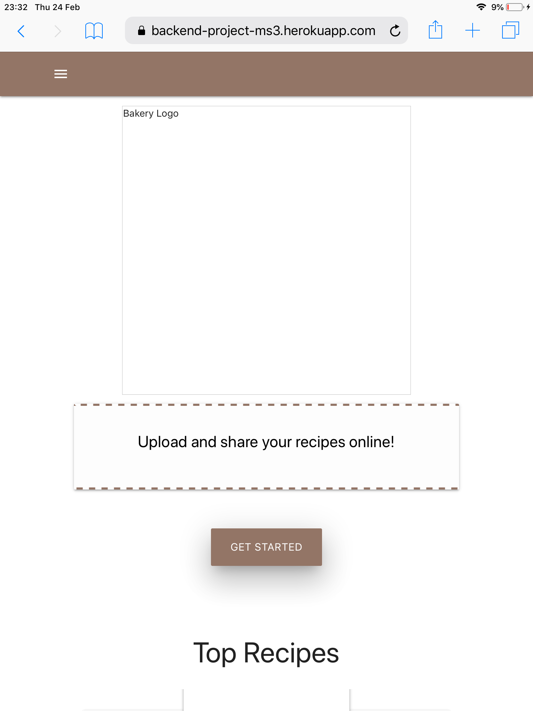

<h1>Testing</h1>

# Code Validation

### HTML5
[W3C HTML Validator](https://validator.w3.org/#validate_by_input) Passed all tests, minus the Jinja errors.

### CSS3 
[W3C CSS Validator](https://jigsaw.w3.org/css-validator/#validate_by_input) No Errors

### JS
[JSHint](https://www.jshint.com/) No Errors

### Python
[PEP8 Online](http://pep8online.com/) No Errors

# Features and Functionality

### Security Testing

- Website was tested on multiple devices.
- Tesed to ensure unregistered users can access user profiles.
- Tested to ensure edit/delete functions only available to users who created the recipe.
- Error messages display when error occurs on site.

### Responsiveness

-	The responsiveness of this site was tested using a Apple MacBook Pro, a Ipad 2, a Iphone X, a Iphonw XR, a Samsung notepad and a windows laptop.

## Features
## (A-Z)

### Search Bar

-	Search bar was tested on multiple devices. Only the recipe type and name feilds are searched and all results show as expected.

# User Stories

## User Story Testing

### New Users

All navigation and interaction works propely.
    
- Nav features were tested on multiple devices as they display differently depending on screen size. I also checked scroll and swiping features on certain elemts to ensure they translated well to mobile devices.

Responsive on all devices.

- All pages were viewd to ensure everything renders in an acceptable way. Breakpoints all work as exprected.

Homepage button.

- Tested homepage button to ensure it took new users to the register page, this changes to the view profile page when logged in. I tested this for multiple users to enure it rendered properly.

Navbar.

- Tested nav links in the same way as above. As a new unregisted user the "Profile" and "Log Out" options should not be available. This worked in all my tests.

Add recipe.

- New users should not be able to add a recipe, this was checked.

Edit/Delete recipe.

- Buttons to edit/delte recipe should not be available to un registered users, the page was sent to multiple people to check that they could not do this.

View/search Recipes

- Unregistered users should have the same ability to view and search all recipes on the website as someone with an account. This worked in all my testing

Register for account.

- Form validation works correctly ensuring the user enteres a valid email. Once created the password is properly hashed and the details are stored on the database. The user recives a visual prompt and is sent to their profile page.

### Logged in user

View Pofile and own recipes.

- checked with multiple users. Flash message display username and acces the recipes created by the user foor easy acsses to delete/edit.

View Pofile and own recipes.

- checked with multiple users. Flash message displays username and displays the recipes created by the user for easy acsses to delete/edit.

Edit and Delete.

- Checked to ensure only the recipes created bu the logged in user can be modified. 
- Edit function works correctly on all feilds, data already stored populates the input feilds. 
- As noted below the "Ingredient" and "Steps" feilds caused issues with deleting themselves, this is now fixed. 
- Delete function works correctly and removes the recipe from all pages of the website. 

Logout.

- User is able to logout and is no longer able to add/alter recipes.

# Bugs and Fixes

## Edit Recipe issue

Due to the .update() function no longer working in the newer PYmongo verseions I had alot of issues with .update_one(). My arrays would delete themselves if the user updated another recipe feild. For instance if you wanted to change the cook time, when the update button was clicked all the steps and ingredients were deleted.

I spent alot of time trying to solve this issue it turns out I left the {{loop.index}} in the input name which was causing the name to change on each loop. This was causing the error.

## iPhone footer spacing

I found that on an iphone x the contact info on the footer did not desplay properly. This did not appear in Chrome device emulation.

This was fixed by altering grid values on smaller screens.

## Card Images

I had an odd issue that had my recipe cards not breaking evenly and leaving empty gaps.

This was fixed by forcing my img heights to be the same. Materialize grid can have issues images of different sizes.

## .webP format on older Apple devices

During my testing process I found a confusing bug, On older apple devices none of my images were loading, however on my iPhone X they worked fine.

I eventually found out that older versions of Safari dont support the webP file format. To fix this all I had to do was revert back to a .jpg format. Although this dropped my performance score on testing I felt it was the best thing to do.

##### User Story Testing

* "I want to view some recipes withouot creating an account"

  * A user is able to view all recipes without needing to register.

    

* "I want to upload my recipe and have my name credited"

  * A logged in user can upload their recipe from the profile page. The full recipe page auto loads the username of the creator.

    

* " I made a mistake and want to edit my recipe"

  * The recipe creator can edit a single feild in the recipe without having to input the whole thing.

    

* "I want to be delete a recipe I no longer want online"

  * The recipe creator can delete their own recipe oon the full recipe page.

    

* "I want to be search for a specific recipe"

  * A user can use the search bar in the recipes page to find specic results.

    

##### General Testing

* All internal page links work

* External link works properly and opens oon new tab.

* Pages/buttons hide/show as expected

* All flash messages display correctly

* Error pages dislpay correctly on invalid input

* 404 and 500 error pages show properly

